# Hauer Heinrich Default Theme Documentation

Creating a new project

## Folder Structure

Since Typo3 12 Typo3 projects typically have two main folders, *public* and *config*. While *public* contains the sources files, like the Typo3 distribution, extensions, and general configs for the project, *config* contains configurations which should not be accessible for the public, e.g., DB access data. Before anything, these two folders, as well as some sub-folders need to be created.

- root-folder
    - config
        - sites
        - system
    - public
        - typo3conf
            - ext
- typo3_sources

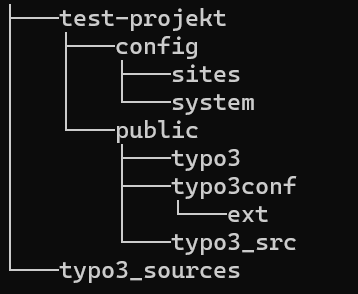

## Getting the Default Theme

As the default theme is just an extension it needs to be cloned / pasted into the *ext* folder.
The default-theme can be cloned from the [git repository](https://github.com/Hauer-Heinrich/hh_theme_default.git)
- git clone https://github.com/Hauer-Heinrich/hh_theme_default.git MY_EXTENSION_NAME

After downloading and pasting/ cloning the theme npm needs to be initialized and npm the node modules need to be installed within the default themes folder (root-folder/public/typo3conf/ext/hh_theme_default).
- `npm init`
- `npm install`

After installing the node modules, a script can be run to initialize the project, here the project name, domain and namespace placeholders will be replaced with their respective definitions.
For this one of the following commands need to be executed:
- bash: `npm run init` or
- powershell: `./init.ps1`

## Create Symlinks
For creating symlinks first of all you need to download a [Typo3 Distribution](https://get.typo3.org/version/13).
This distributions need to be unpacked and is best placed in a folder called *typo3_sources*, which should be located on the same level as your project root.
Symlinks to the respective Typo3 Distribution, its Typo3 folder and it's index.php need to be created within the *public* folder. The benefit of symlinks is creating easy maintainability when it comes to updating minor and major Typo3 versions. Run following commands in your bash or cmd:
Bash:
- `ln -s ../../typo3_sources/{your_typo3_version} typo3_src`
- `ln -s typo3_src/typo3 typo3`
- `ln -s typo3_src/index.php index.php`

or CMD:
- `mklink /d typo3_src ../../typo3_sources/{your_typo3_version}`
- `mklink /d typo3 typo3_src/typo3`
- `mklink index.php typo3_src/index.php`

When this was successful you should be able to see your symlinks in your console (bash: ls -lah | cmd: dir) and explorer or IDE and it should look somewhat like this: \
CMD: \
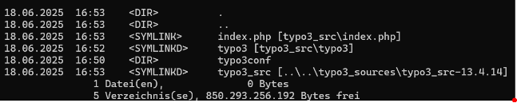 \
Explorer: \
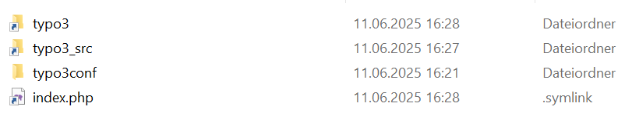

## Local Server Setup

After setting up your folder structure and symlinks you can begin setting up your local server. There a multitude of options, but we will discuss only two: IIS and Caddy

IIS:
- Open IIS
- Click add Website
    - provide Sitename
    - provide physical path (path to *public*)
    - provide Hostname ("URL", here: ends with .localhost)
- Specify bindings
- set PHP Version in Handlers (must be 8.2+)

    Additionally a web.config file must be provided in your *public* folder. An example file can be found in the default theme in the folder "exmaples". It neeed to be renamed to web.config, the **TYPO3_APP_PATH** needs to point to your root-folder, the **TYPO3_ROOT_PATH** needs to point to your public folder. Both paths need to be absolute.

Caddy
(see ReadMe, [Respository](https://github.com/Teisi/caddy-server-windows))
- Clone/ download Caddy Repository
- Create a Server file
- Start Caddy
- provide PHP Paths

Many customers have ngnix server, which need, similar to IIS's web.config file, a .htaccess file. An example file can be found in examples in within the default theme. It needs to be renamed as well as provided the correct paths for **TYPO3_ROOT_PATH** and **TYPO3_ROOT_ROOT**.

## FIRST INSTALL

To complete the initialization of the Typo3 project, only a few more steps are necessary. Except for on, all of those can be completed via the Typo3 Install Tool.
To access the Install Tool, first a file named **FIRST_INSTALL** need to be created within your *public* folder.
Afterwards the install tool should be accessible under: your-domain.localhost/typo3/install.php and you should see the following:  \
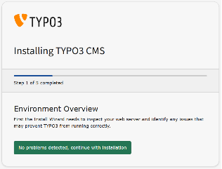

Now you need to work through the install tool:

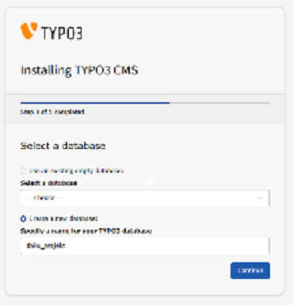
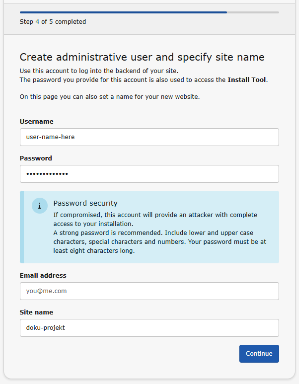
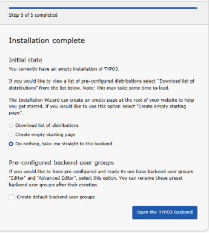

When you reach the last step, select *Do nothing, take me straight to the backend*, enter you newly created credentials and login.

## Finalizing the Installation

After loggin in to the backend, can begin finalizing your installation.

> NOTE  \
> Its best to always keep a maintenance tab open, if you need to flush caches to fully reload you page.

First, you need to install the default-theme extension and all extensions which are mandatory for this project. \
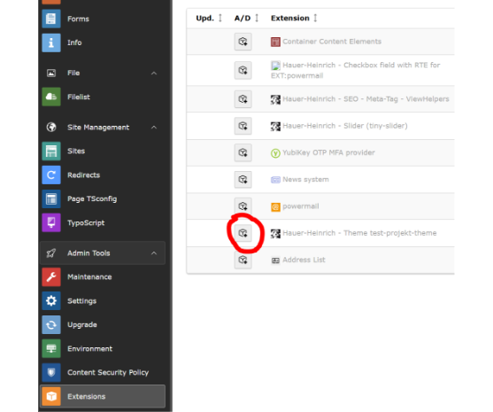

Afterwards it might be neceassary to run the Upgrade Wizard.
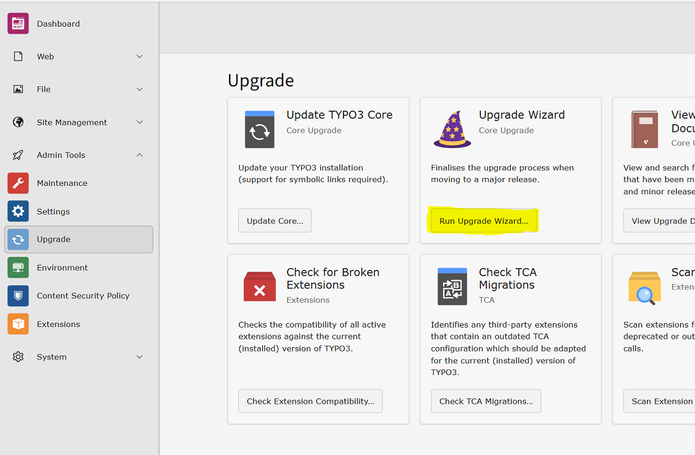

Now you need to create a new starting page and edit it's page properties. This page must be marked as root page in the tab Behaviour and afterwards, in the tab Resources, it needs to be assigned the Theme TS.

 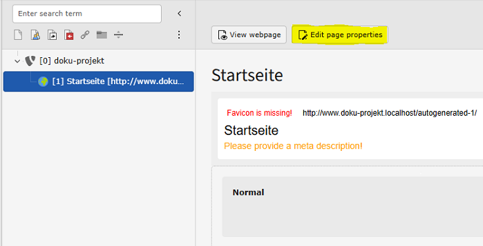

Mark as root page: \
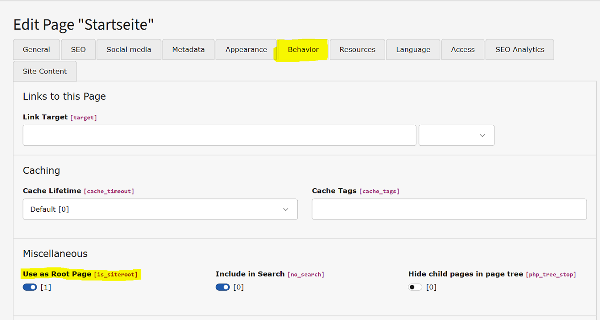

Include PageTS:  \
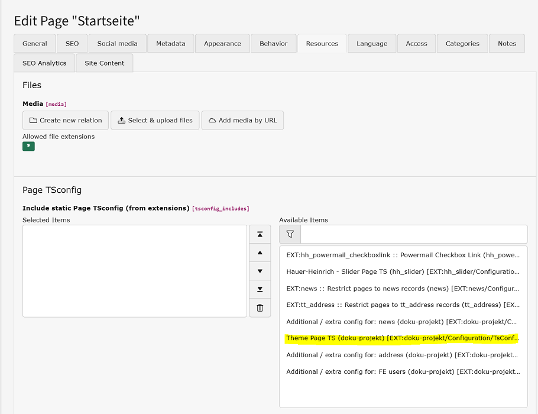

Now, only the TypoScript need to be activated and the setup is done.
Select TypoScript in the leftmost site tree, select your root page in the adjacent site tree, change the dropdown to *Edit TypoScript* and create a new Root TypoScript Record. \

Navigate to *Advanced Options* and select the Theme TS from the options.
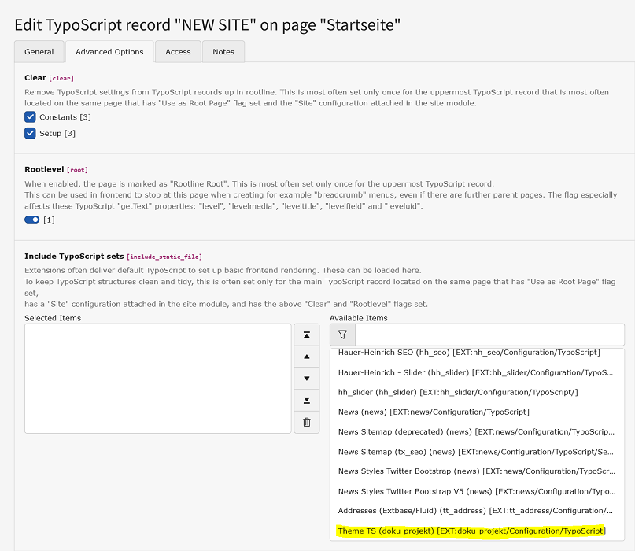

## Additional Configurations

The default theme also provides differnet configurations for different development environments, (.localhost, preview and production).
Those configurations can easily be included by pasting the file *additonal.php* to your *config/system* folder.
